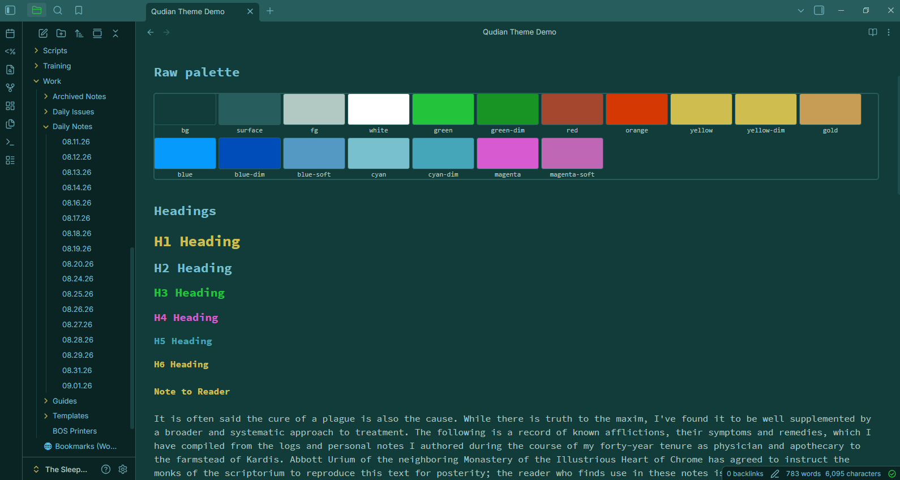
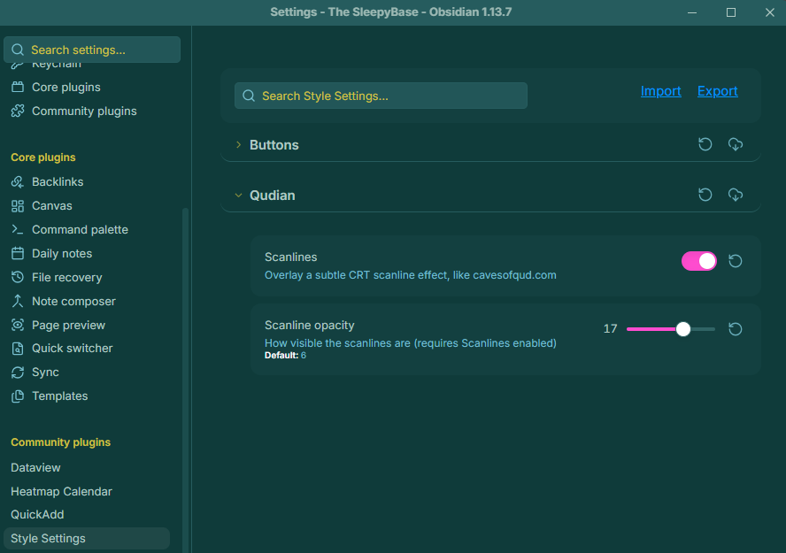

# Qudian for Obsidian

Qudian is an independent theme project made with love and admiration. It is not affiliated with, endorsed by, or connected to any game or trademark holder.

This is the Obsidian port of the Qudian theme, forked from the [original Qudian project](https://github.com/dwwr/qudian) (terminal + VS Code).

Its look is inspired by the UI of [Caves of Qud](https://www.cavesofqud.com/), by Freehold Games.

## Contents

- `manifest.json`: Obsidian theme manifest
- `theme.css`: Obsidian theme stylesheet
- `Qudian Theme Demo.md`: a sample note showcasing the theme's styling

### Scanlines

An optional, CRT scanline overlay can be added with the [Style Settings](https://github.com/mgmeyers/obsidian-style-settings) plugin. The same kind of effect you'll see in CoQ itself. 
Off by default, toggle and opacity adjustable from **Settings → Style Settings → Qudian**:

With it enabled, notes pick up the same faint CRT texture as the game.

No plugins are required to use the base theme itself.

## Font

To get that much closer to CoQ's UI, install [Source Code Pro](https://fonts.google.com/specimen/Source+Code+Pro) and set it as your theme font.

- **Windows:** unzip the download, select all `.ttf` files, right-click → **Install for all users**.
- **Fedora:** `sudo dnf install adobe-source-code-pro-fonts`
- **Arch:** `sudo pacman -S adobe-source-code-pro-fonts`
- **Debian/Ubuntu:** no official package — unzip the Google Fonts download into `~/.local/share/fonts/` and run `fc-cache -f`.

## Installation

### From Obsidian's community themes

[Theme Listing](https://community.obsidian.md/themes/qudian)

1. In Obsidian, go to **Settings → Appearance → Themes → Manage**.
2. Search for **Qudian** and select **Install**.
3. Once installed, click to activate it.

### From source

1. Clone or download this repository.
2. Copy `manifest.json` and `theme.css` into your vault's `.obsidian/themes/Qudian/` folder (create it if it doesn't exist).
3. In Obsidian, go to **Settings → Appearance → Themes** and select **Qudian**.

## License

MIT. See [LICENSE](LICENSE).
