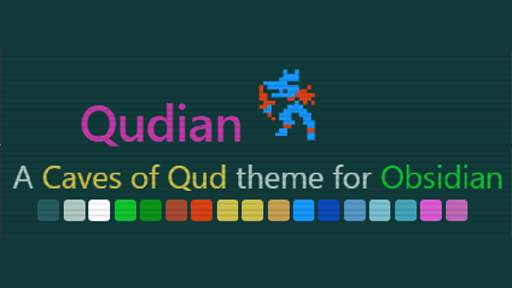

# Qudian for Obsidian

Qudian is an independent theme project made with love and admiration. It is not affiliated with, endorsed by, or connected to any game or trademark holder.

This is the Obsidian port of the Qudian theme, forked from the [original Qudian project](https://github.com/dwwr/qudian) (terminal + VS Code).

Its look is inspired by the UI of [Caves of Qud](https://www.cavesofqud.com/), by Freehold Games.



## Contents

- `manifest.json` — Obsidian theme manifest
- `theme.css` — Obsidian theme stylesheet
- `Qudian Theme Demo.md` — a sample note showcasing the theme's styling

## Font

To get that much closer to CoQ's UI use this theme with the Source Code Pro font. 

### Windows

1. Download the family from [Google Fonts](https://fonts.google.com/specimen/Source+Code+Pro) and unzip it.
2. Select all the `.ttf` files, right-click, and choose **Install for all users** (or just **Install**).

### Linux

- Fedora: `sudo dnf install adobe-source-code-pro-fonts`
- Arch: `sudo pacman -S adobe-source-code-pro-fonts`
- Debian/Ubuntu (no official package): download from [Google Fonts](https://fonts.google.com/specimen/Source+Code+Pro), unzip, then:
  ```bash
  mkdir -p ~/.local/share/fonts
  cp *.ttf ~/.local/share/fonts/
  fc-cache -f -v
  ```

## Install

### From Obsidian's community themes

1. In Obsidian, go to **Settings → Appearance → Themes → Manage**.
2. Search for **Qudian** and select **Install**.
3. Once installed, click to activate it.

### From source

1. Clone or download this repository.
2. Copy `manifest.json` and `theme.css` into your vault's `.obsidian/themes/Qudian/` folder (create it if it doesn't exist).
3. In Obsidian, go to **Settings → Appearance → Themes** and select **Qudian**.

## License

MIT — see [LICENSE](LICENSE).
